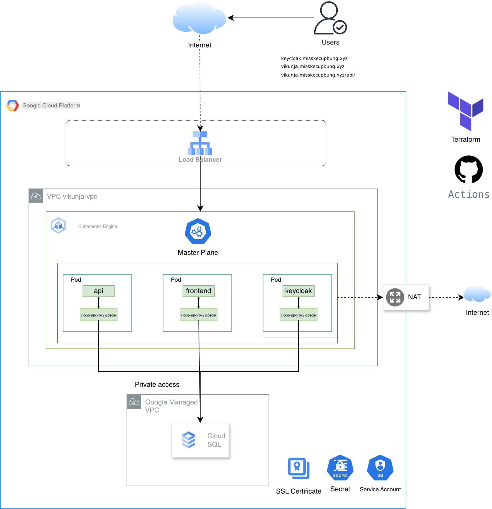

# **Vikunja ToDo Application – DevOps Case Study**

## **1. Overview**

This case study showcases an end-to-end, container-native deployment of the **Vikunja ToDo** application on **Kubernetes**, emphasizing:

* Repeatable infrastructure and deployment automation (Terraform + Helm)
* Proper use of Kubernetes primitives (Deployments, Services, Ingress, ConfigMaps, Secrets)
* High availability and resilience design
* Network optimization and secure connectivity (Private Service Networking & Load Balancing)
* Database strategy and rationale (Managed vs. Self-Hosted)
* *(Optional)* Identity and Access Management via **Keycloak (OIDC)**
* Observability and troubleshooting practices

The solution is portable across both **local clusters** (Minikube/kind) and **managed Kubernetes services** (GKE/EKS/AKS). The current implementation targets **Google Kubernetes Engine (GKE)**.

---

## **2. Deployment Templating Tool – Choice & Rationale**

**Chosen Tool: Helm**

**Why Helm:**

* **Parameterization & reuse** – Separate values files per environment (e.g., dev, prod) without duplicating manifests.
* **Composable charts** – Distinct charts for `vikunja`, `keycloak`, and `platform` (Ingress/shared routing) promote modularity.
* **Templating flexibility** – Conditional logic supports optional features such as Cloud SQL proxies or OIDC providers.
* **Ecosystem maturity** – Widely adopted, integrates with CI/CD for linting, templating, and security scanning.
* **Extensibility** – Handles complex patterns (initContainers, sidecars, HPAs) cleanly within templates.

**Alternatives considered:**

* **Kustomize** – Great for overlays, but less ergonomic for computed values or loops.
* **Jsonnet** – Extremely flexible, but higher cognitive load and smaller Kubernetes community footprint.
* **Plain YAML** – Not maintainable for multi-environment or parameterized configurations.

**Conclusion:**
Helm strikes the best balance of power, maintainability, and operational familiarity.

---

## **3. Architecture Summary**




## **3A. Domains & Applications**

The deployment exposes two public hosts; the Vikunja API is path-routed beneath the same vikunja host rather than using a separate subdomain.

| Surface / Component        | Purpose                                      | Host + Path                                 | Ingress Backend Service | Notes |
| -------------------------- | -------------------------------------------- | ------------------------------------------- | ----------------------- | ----- |
| **Vikunja Frontend (Web)** | SPA / static web UI                          | `https://vikunja.misskecupbung.xyz/`        | `vikunja` (port 80)     | Serves the compiled frontend (container port 80) |
| **Vikunja API**            | REST API consumed by the frontend & clients  | `https://vikunja.misskecupbung.xyz/api`     | `vikunja` (port 3456)   | Path prefix `/api` routed to API container port 3456 |
| **Keycloak** *(optional)*  | OIDC / SSO identity provider                 | `https://keycloak.misskecupbung.xyz/`       | `keycloak` (port 80)    | Separate host for identity boundary |

**Routing Implementation (from `charts/platform/templates/ingress.yaml`):**
```yaml
rules:
  - host: vikunja.misskecupbung.xyz
    http:
      paths:
        - path: /api
          pathType: Prefix
          backend: { service: { name: vikunja, port: { number: 3456 } } }
        - path: /
          pathType: Prefix
          backend: { service: { name: vikunja, port: { number: 80 } } }
  - host: keycloak.misskecupbung.xyz
    http:
      paths:
        - path: /
          pathType: Prefix
          backend: { service: { name: keycloak, port: { number: 80 } } }
```

**Notes:**

* Only two DNS A records are required (`vikunja.misskecupbung.xyz`, `keycloak.misskecupbung.xyz`), both pointing to the same global static IP of the HTTPS load balancer.
* `/api` is listed before `/` in the Ingress to guarantee correct prefix matching and ensure API calls are not handled by the frontend.
* The single `vikunja` Service exposes two ports (`80` for web, `3456` for API); container-native NEGs allow the LB to health‑check each backend path efficiently.
* The previous placeholder "Platform Layer" domain is not externally exposed; the platform chart purely provisions the Ingress and ManagedCertificate resources.
* Certificates are managed through **Google ManagedCertificates** referenced by Ingress annotation.

---

**Key Components**

* **Ingress** – Host-based routing backed by container-native NEGs for efficient load balancing.
* **Database** – Managed Cloud SQL (PostgreSQL) ensures durability, backups, and maintenance offloading.
* **Secrets** – Managed via Kubernetes Secrets (DB credentials, OIDC client secrets) injected through Helm values.
* **Configuration** – Delivered through ConfigMaps and environment variables.

---

## **4. Kubernetes Manifests (Rendered Examples)**

Helm templates produce the following Kubernetes resources.
Samples are shown here for clarity.

### **4.1 Vikunja Application Deployment**

```yaml
apiVersion: apps/v1
kind: Deployment
metadata:
  name: vikunja
  labels:
    app: vikunja
spec:
  replicas: 2
  selector:
    matchLabels:
      app: vikunja
  strategy:
    type: RollingUpdate
    rollingUpdate:
      maxUnavailable: 1
      maxSurge: 1
  template:
    metadata:
      labels:
        app: vikunja
    spec:
      containers:
        - name: api
          image: vikunja/api:latest
          ports:
            - containerPort: 3456
          env:
            - name: VIKUNJA_DATABASE_HOST
              value: 127.0.0.1
          resources:
            requests:
              cpu: 100m
              memory: 128Mi
            limits:
              cpu: 500m
              memory: 512Mi
          readinessProbe:
            httpGet:
              path: /health
              port: 3456
            initialDelaySeconds: 5
          livenessProbe:
            httpGet:
              path: /health
              port: 3456
            initialDelaySeconds: 15
        - name: frontend
          image: vikunja/frontend:latest
          ports:
            - containerPort: 80
          resources:
            requests:
              cpu: 50m
              memory: 64Mi
            limits:
              cpu: 200m
              memory: 256Mi
```

**Service**

```yaml
apiVersion: v1
kind: Service
metadata:
  name: vikunja
  annotations:
    cloud.google.com/neg: '{"ingress": true}'
spec:
  type: ClusterIP
  selector:
    app: vikunja
  ports:
    - name: http
      port: 80
      targetPort: 80
```

---

### **4.2 Managed Database (Cloud SQL Proxy Sidecar)**

```yaml
apiVersion: apps/v1
kind: Deployment
metadata:
  name: vikunja-db-proxy
spec:
  replicas: 1
  selector:
    matchLabels:
      app: vikunja-db-proxy
  template:
    metadata:
      labels:
        app: vikunja-db-proxy
    spec:
      containers:
        - name: cloud-sql-proxy
          image: gcr.io/cloud-sql-connectors/cloud-sql-proxy:2.11.0
          args:
            - "--port=5432"
            - "$(PROJECT_ID):$(REGION):vikunja-db"
          resources:
            requests:
              cpu: 20m
              memory: 32Mi
          livenessProbe:
            tcpSocket:
              port: 5432
```

**Service**

```yaml
apiVersion: v1
kind: Service
metadata:
  name: vikunja-db
spec:
  type: ClusterIP
  selector:
    app: vikunja-db-proxy
  ports:
    - port: 5432
      targetPort: 5432
```

---

### **4.3 Self-Hosted PostgreSQL (Alternative)**

Used only if managed services are not permitted.
Example with a StatefulSet and PersistentVolumeClaims.

*(Content unchanged for brevity.)*

---

## **5. Database Strategy Justification**

**Chosen Option:** Managed Cloud SQL (PostgreSQL)

**Reasons:**

* Automated backups, PITR, and patching reduce operational overhead.
* Regional HA tier provides seamless failover.
* VPC Private Service Networking ensures secure, low-latency DB access.
* Simplifies maintenance, scaling, and compliance alignment.

**Trade-off:** Slightly higher cost compared to self-hosted, but significantly lower operational risk.

Self-hosting is only justified for on-prem requirements, cost-sensitive scenarios, or when unsupported extensions are needed.

---

## **6. High Availability & Resilience**

* Stateless workloads with 2+ replicas and controlled rolling updates.
* Managed regional database option for production.
* Health probes ensure fail-fast behavior and safe rollouts.
* Horizontal Pod Autoscaler (HPA) active for API/combined deployment.
* **Implemented:** PodDisruptionBudget (minAvailable: 1) for graceful voluntary disruptions.
* Anti-affinity & topology spread left as future enhancement.

---

## **7. Load Balancing & Traffic Routing**

* Global HTTPS Load Balancer terminates TLS and routes based on hostname.
* Static global IP ensures DNS stability.
* Container-native NEGs enable direct load balancing to pods with faster health checks.

---

## **8. Network Optimization**

* **Container-native NEGs** for direct traffic paths.
* **Resource requests & limits** tuned to prevent throttling.
* **Private Service Networking** for secure and low-latency DB connections.
* **PgBouncer** recommended for future connection pooling needs.
* **Keep-alive & compression** handled by Ingress defaults.

---

## **9. Identity & Access Management (Optional – Keycloak)**

* Deploy Keycloak via Helm with realm and client configured for Vikunja.
* OIDC setup includes redirect URIs and client secrets stored as Kubernetes Secrets.
* Enables SSO, centralized identity, and MFA integration.

---

## **10. Observability & Troubleshooting**

**Baseline:**
Readiness/liveness probes and `kubectl top` for health and resource metrics.

**Enhancements (recommended):**

* Prometheus + kube-state-metrics for cluster and app monitoring.
* Loki or Cloud Logging for centralized log aggregation.
* Alerts for error rates, restarts, and DB connection issues.
* Optional tracing via OpenTelemetry for latency profiling.

**Diagnostic Script:**
`scripts/diagnose.sh` collects pods, events, and logs to accelerate incident triage.

---

## **11. Security Considerations**

* **Workload Identity** replaces service account keys where possible.
* **Secrets management** through Kubernetes or external managers (e.g., Secret Manager).
* **Implemented:** Baseline NetworkPolicy restricting ingress to ports 80/3456 and limiting egress to DNS + Postgres (expand for finer-grained controls later).
* **TLS termination** at Ingress; mTLS can be introduced internally for zero-trust networks.

---

## **12. Future Improvements**

| Category              | Improvement                                                     |
| --------------------- | --------------------------------------------------------------- |
| **Scaling**           | Implement HPA/VPA for API and frontend                          |
| **Resilience**        | Add PodDisruptionBudgets, anti-affinity, regional DB            |
| **Security**          | Enforce NetworkPolicies, Cosign image signing, external secrets |
| **Performance**       | Introduce PgBouncer, CDN for static assets                      |
| **Cost Optimization** | Autoscale to lower tiers during off-peak hours                  |
| **Observability**     | Integrate full Prometheus/Grafana/Loki stack                    |

---

## **13. How to Run (Developer Quickstart)**

```bash
# Deploy Vikunja (Cloud SQL-enabled)
helm upgrade --install vikunja charts/vikunja \
  -f charts/vikunja/values.yaml \
  --set cloudsql.enabled=true \
  --set cloudsql.instanceConnectionName="$PROJECT:$REGION:vikunja-db"

# Optional: Deploy Keycloak
helm upgrade --install keycloak charts/keycloak \
  -f charts/keycloak/values.yaml \
  --set cloudsql.enabled=true \
  --set cloudsql.instanceConnectionName="$PROJECT:$REGION:vikunja-db"

# Deploy shared ingress platform
helm upgrade --install platform charts/platform \
  --set staticIpName=vikunja-platform-lb-ip \
  --set hosts.vikunja=vikunja.example.com \
  --set hosts.keycloak=keycloak.example.com
```

---

## **14. Summary**

This solution delivers a **secure, resilient, and modular** Kubernetes deployment for the Vikunja ToDo application.
It leverages **Helm** for reusable, parameterized infrastructure; **managed services** for stateful components; and a **DevOps-driven foundation** ready to evolve with scaling, observability, and security enhancements.

---

Would you like me to make it more **executive-summary ready** (e.g., for a presentation or portfolio PDF) — concise with visuals and less YAML — or keep it **as a technical deep-dive version** for repository documentation (README or internal doc)?
