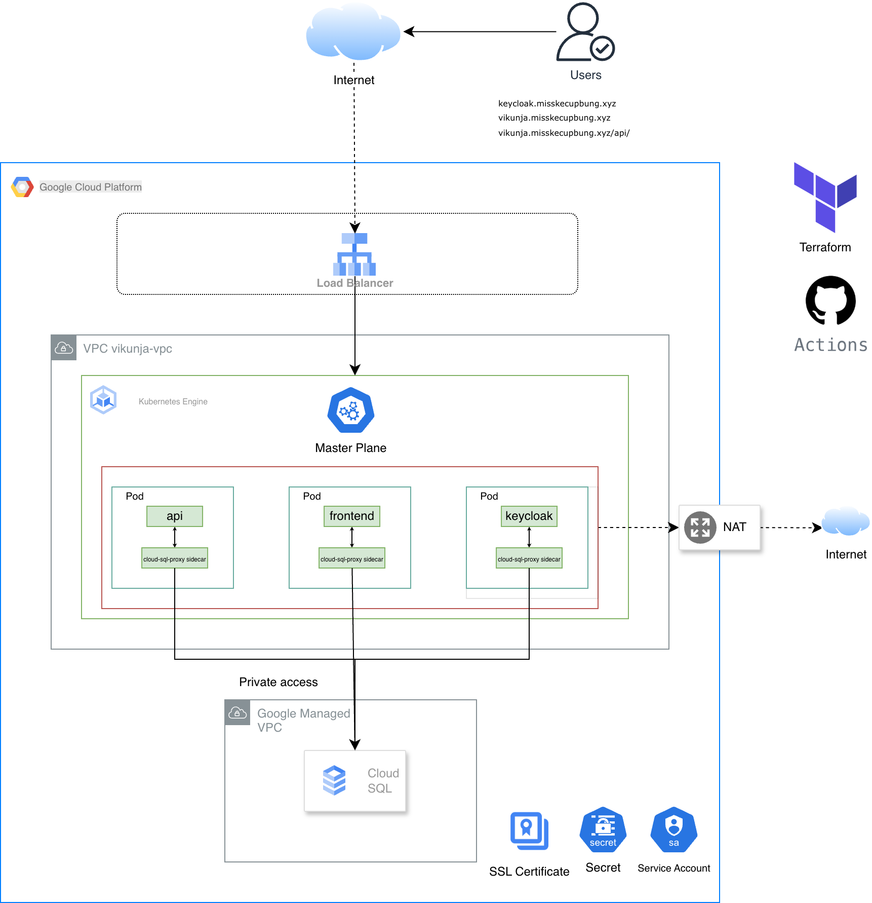

<!-- Concise, dev-focused README; see CASE_STUDY.md for the full narrative & rationale -->
# Vikunja on GKE

Container-native, automated deployment of the Vikunja task management platform (API + frontend) on Google Kubernetes Engine. Infrastructure is provisioned with Terraform; applications are packaged and deployed with Helm. Optional Keycloak (OIDC) and managed Cloud SQL Postgres are integrated behind a single global HTTPS load balancer.

> For the detailed architectural deep-dive (tooling rationale, alternatives, HA, security posture), read: [CASE_STUDY.md](./CASE_STUDY.md)

## TL;DR Features
* Terraform modules: VPC/networking, GKE (Workload Identity), Cloud SQL (private IP)
* Helm charts: `vikunja` (API+frontend), `keycloak` (optional IdP), `platform` (Ingress + certs)
* Single global static IP, host + path routing (`/api` vs root) via GCE Ingress
* OIDC login (Keycloak) pluggable through values
* Horizontal scaling (HPA), PodDisruptionBudget, basic NetworkPolicy skeleton
* GitHub Actions pipeline (plan, apply, deploy, validate)

## Architecture Snapshot
```
Internet → Global HTTPS LB (ManagedCertificate) → Ingress
    ├─ vikunja.misskecupbung.xyz (/ → frontend, /api → API)
    └─ keycloak.misskecupbung.xyz (optional)
Front/API Pods → Cloud SQL (private service networking)
```




## Repo Layout
| Path | Purpose |
|------|---------|
| `modules/network` | VPC, subnet, secondary ranges, private service networking |
| `modules/gke` | GKE cluster + node pool (Workload Identity) |
| `modules/cloudsql` | Postgres instance + DB/users (private IP) |
| `charts/vikunja` | App deployment (API + frontend, config, HPA, service, network policy) |
| `charts/keycloak` | Optional Keycloak deployment |
| `charts/platform` | Ingress + ManagedCertificate + host routing |
| `environments/` | Environment-specific tfvars & backend config |
| `scripts/diagnose.sh` | Cluster troubleshooting helper |

## Quick Start (Dev)
Prereqs: `terraform >= 1.6`, `gcloud`, `helm`, `openssl`, authenticated `gcloud` session.
```bash
PROJECT_ID="your-project"; REGION="us-central1"
gsutil mb -p "$PROJECT_ID" -l $REGION gs://$PROJECT_ID-tf-state || true
terraform init -backend-config="bucket=$PROJECT_ID-tf-state" -backend-config="prefix=terraform"
terraform workspace new dev 2>/dev/null || true
terraform workspace select dev
export TF_VAR_vikunja_db_password="$(openssl rand -base64 32)"
export TF_VAR_keycloak_db_password="$(openssl rand -base64 32)"
terraform apply -var-file=environments/dev.tfvars -auto-approve

# Kube context
gcloud container clusters get-credentials $(terraform output -raw gke_cluster_name) --region $REGION

# Secrets (DB + OIDC client placeholder)
kubectl create secret generic vikunja-db --from-literal=password="$TF_VAR_vikunja_db_password" --dry-run=client -o yaml | kubectl apply -f -
kubectl create secret generic vikunja-oidc-client --from-literal=clientsecret="CHANGE_ME" --dry-run=client -o yaml | kubectl apply -f -

# Deploy Vikunja (Cloud SQL instance name from output)
helm upgrade --install vikunja charts/vikunja \
  --set cloudsql.instanceConnectionName="$(terraform output -raw cloudsql_instance)" \
  -f charts/vikunja/values.yaml

# (Optional) Keycloak
helm upgrade --install keycloak charts/keycloak -f charts/keycloak/values.yaml

# (Optional) Platform ingress (if not already applied by pipeline)
helm upgrade --install platform charts/platform -f charts/platform/values.yaml
```
Ingress/DNS pending? Temporary access:
```bash
kubectl port-forward svc/vikunja 8080:80
open http://localhost:8080
```

## Core Helm Values (Vikunja)
| Key | Meaning |
|-----|---------|
| `postgres.secretName` | Secret containing DB password |
| `cloudsql.instanceConnectionName` | GCP instance connection name if using Cloud SQL connector |
| `openid.providers[]` | Array of OIDC providers (name, authurl, logouturl, clientid, scopes) |
| `openid.secretName` | Secret with confidential client secret |
| `autoscaling.enabled` | Enable HPA (CPU target via `targetCPUUtilizationPercentage`) |
| `resources` | Container resource requests/limits |

Minimal OIDC example (Keycloak):
```yaml
openid:
  enabled: true
  secretName: vikunja-oidc-client
  providers:
    - name: keycloak
      authurl: https://keycloak.misskecupbung.xyz/realms/vikunja/protocol/openid-connect/auth
      logouturl: https://keycloak.misskecupbung.xyz/realms/vikunja/protocol/openid-connect/logout
      clientid: vikunja
      scopes: [openid, email, profile]
```

## CI/CD (GitHub Actions)
Stages (conceptual): Plan → Apply Infra → Deploy Keycloak (optional) → Deploy Vikunja → Deploy Platform (Ingress). Includes Helm lint & conformance checks.

## Operations Cheatsheet
```bash
# Scale (if HPA disabled)
kubectl scale deploy/vikunja --replicas=3
# Rollback Helm release
helm rollback vikunja <revision>
# Restart rollout
kubectl rollout restart deploy/vikunja
# Destroy dev infra
terraform workspace select dev && terraform destroy -var-file=environments/dev.tfvars -auto-approve
```
Troubleshoot:
```bash
kubectl logs deploy/vikunja -c api | grep -i openid || true
kubectl get events --sort-by=.metadata.creationTimestamp | tail -20
```

## Security & Hardening (Current vs Next)
Current: Private Cloud SQL, Workload Identity, basic NetworkPolicy (ingress restricted to service ports), secrets via Kubernetes, PDB.
Next steps:
* Deny-by-default NetworkPolicies + explicit allowlists
* External Secrets (GCP Secret Manager)
* Image provenance (Cosign) & vulnerability scans
* Resource limit tuning + topology spread / pod anti-affinity
* Prometheus + alerting, structured logging aggregation

## Roadmap Highlights
| Area | Future Enhancement |
|------|--------------------|
| Scaling | Add VPA or refine HPA metrics | 
| DB | Introduce PgBouncer / connection pooling | 
| Security | mTLS internal, stronger PSP/PodSecurity admission | 
| Observability | Full metrics + tracing + logs stack | 
| Reliability | Regional / multi-zone DB tier, chaos testing | 

## Quick Issue Triage
| Symptom | Check |
|---------|-------|
| 403 after OIDC login | Redirect URI & provider name |
| DB auth failures | Secret name/key & env var mapping |
| OIDC providers missing | Rendered ConfigMap & pod logs |
| Startup probe fail | Probe timings in values |

## Contributing / Extending
Open a feature branch, run terraform plan & helm lint in CI. For architectural or security changes, update `CASE_STUDY.md` accordingly.

---
Default settings optimize for development speed. Review secrets, sizing, network boundaries, and observability before promoting to production. See [CASE_STUDY.md](./CASE_STUDY.md) for justification & deeper context.
<!-- End of concise README -->